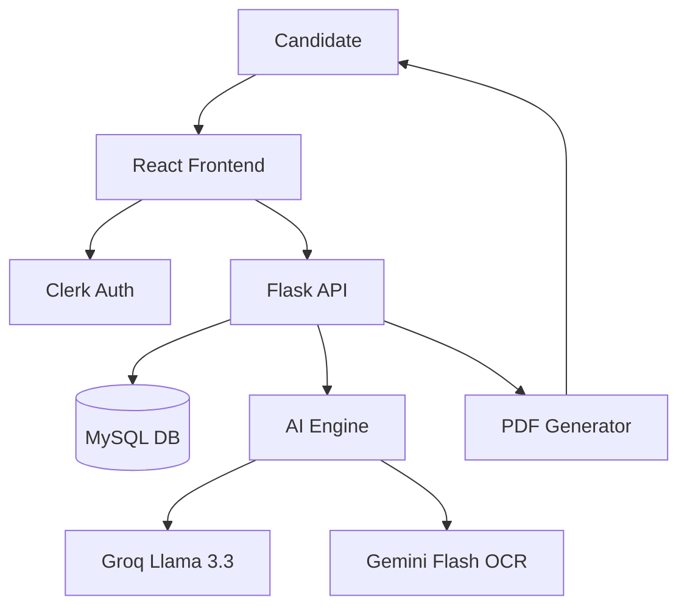

# AI Interview Coach v2.2🎯

An intelligent, end-to-end platform designed to help job seekers master their interview skills through personalized AI-driven simulation, resume analysis, and premium performance reporting.

## 🚀 Key Features

### 1. Personalized AI Coach Chat
- **Intelligent Resume Parsing**: Supports PDF and Image (JPG/PNG) uploads with high-accuracy OCR.
- **Dynamic Personalization**: Automatically extracts the candidate's name and tailors the conversation.
- **Context-Aware Dialogue**: Powered by Groq (Llama 3.3) and Gemini (Flash), providing human-like interview guidance.

### 2. Structured Mock Interviews
- **Role-Specific Scenarios**: Generate 5 targeted questions based on the job role, category (Technical/HR/Behavioral), and difficulty level.
- **Real-time Feedback**: Instant scoring and constructive feedback for every answer using advanced LLM evaluation.
- **Progress Tracking**: Visual progress indicators and session stats.

### 3. Premium Performance Reports
- **Executive Summary**: Metric cards for overall score, qualification status, and role metadata.
- **Deep-Dive Analysis**: Detailed question-by-question breakdown with score, user response, coach feedback, and an "Ideal Answer" comparison.
- **Aesthetic PDF Layout**: Professional, card-based PDF design ready for download and review.

## 🛠️ Tech Stack

- **Frontend**: React.js, Tailwind CSS, Vite, Lucide Icons.
- **Backend**: Python, Flask, Flask-CORS.
- **Database**: MySQL (Session & User Management).
- **Authentication**: Clerk (Enterprise-grade auth).
- **AI/LLM Engine**:
  - **Groq (Llama 3.3)**: Primary engine for high-speed chat and evaluations.
  - **Google Gemini (Flash)**: High-performance OCR and multimodal resume parsing.
- **PDF Core**: ReportLab (Custom premium layouts).

## 📋 Prerequisites

- Python 3.8+
- Node.js 18+
- MySQL Server
- Clerk API Keys
- Groq & Gemini API Keys

## ⚙️ Installation & Setup

### 1. Create Environment Variables
Create a `.env` file in the `server` directory:
```env
GROQ_API_KEY=your_key
GEMINI_API_KEY=your_key
MYSQL_HOST=localhost
MYSQL_USER=your_user
MYSQL_PASSWORD=your_password
MYSQL_DATABASE=interview_coach
```

### 2. Backend Setup
```bash
cd server
python -m venv venv
.\venv\Scripts\activate  # Windows
pip install -r requirements.txt
python app.py
```

### 3. Frontend Setup
```bash
cd client
npm install
npm run dev
```

## 🏗️ Architecture



## 🌟 Recent Updates
- ✅ **Personalized Greeting**: AI now addresses candidates by name extracted from resumes.
- ✅ **Gemini 1.5 Integration**: Optimized OCR using `gemini-flash-latest` for faster processing.
- ✅ **Premium PDF Redesign**: Modern card-based reporting with visual metrics.
- ✅ **API Stability**: Enhanced error handling for high-concurrency LLM calls.

---
Developed as part of the Infosys SpringBoard Internship Project.
